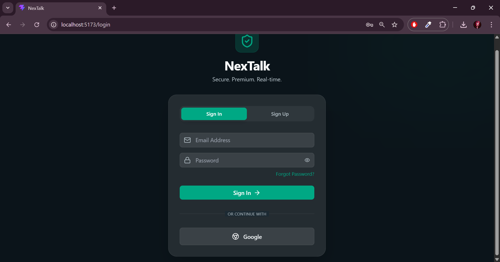
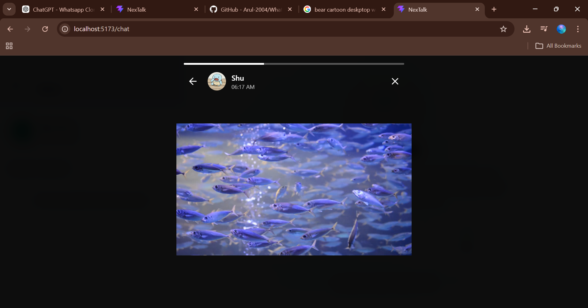
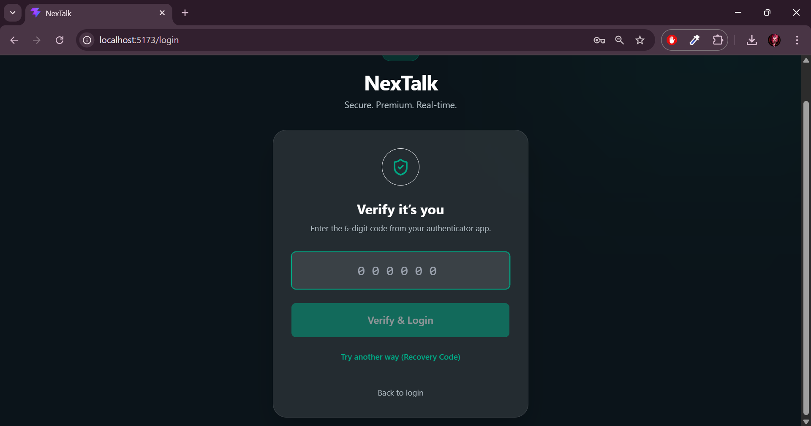

<div align="center">

# NexTalk

### [Check out the live site here](https://nextalk-kappa.vercel.app/)

### A production-grade, real-time chat application inspired by WhatsApp Web

[](https://nodejs.org/)
[](https://reactjs.org/)
[](https://www.mongodb.com/)
[](https://socket.io/)
[](https://expressjs.com/)

</div>

---

## Screenshots

<table>
  <tr>
    <td align="center"><b>Landing Page</b></td>
    <td align="center"><b>Login & Auth</b></td>
  </tr>
  <tr>
    <td></td>
    <td></td>
  </tr>
  <tr>
    <td align="center"><b>Light & Dark Themes</b></td>
    <td align="center"><b>Message Options</b></td>
  </tr>
  <tr>
    <td></td>
    <td></td>
  </tr>
  <tr>
    <td align="center"><b>Chat Header Options</b></td>
    <td align="center"><b>Media Gallery</b></td>
  </tr>
  <tr>
    <td></td>
    <td></td>
  </tr>
  <tr>
    <td align="center"><b>Status / Stories</b></td>
    <td align="center"><b>Audio Calling</b></td>
  </tr>
  <tr>
    <td></td>
    <td></td>
  </tr>
  <tr>
    <td align="center"><b>Add Contacts</b></td>
    <td align="center"><b>Invite Contacts</b></td>
  </tr>
  <tr>
    <td></td>
    <td></td>
  </tr>
  <tr>
    <td align="center" colspan="2"><b>Multi-Factor Authentication</b></td>
  </tr>
  <tr>
    <td colspan="2" align="center"></td>
  </tr>
</table>

---

## Tech Stack

| Layer | Technology |
|---|---|
| **Frontend** | React 18, Vite, Tailwind CSS, Framer Motion, Lucide React |
| **Backend** | Node.js, Express.js |
| **Database** | MongoDB Atlas (Mongoose ODM) |
| **Real-time** | Socket.IO (WebSockets) |
| **Calling** | WebRTC (peer-to-peer audio) |
| **Auth** | JWT, bcryptjs, Passport.js (Google OAuth) |
| **File Uploads** | Multer |
| **Push Notifications** | Web Push API |
| **Design** | Glassmorphism, custom CSS variables, doodle wallpapers |

### Third-Party APIs Used
- **WebRTC API**: Used for establishing true peer-to-peer audio connections securely over the network.
- **Web Push API**: Standardized backend web-push framework handling native push notifications triggered anywhere in the OS.
- **Giphy API**: For querying and fetching optimized animated GIFs within the message input modal.
- **Google OAuth API**: Secured authentication bypassing local credential creation via Google Passport strategy.
- **Deep Email Validator**: Backend SMTP & MX-Record API used to block fake or disposable emails at signup.

---

## Full Feature List

### Messaging
- **Real-time 1-on-1 messaging** via Socket.IO with instant delivery
- **Group chat** — create groups, add members, and send messages to multiple participants simultaneously
- **Reply to specific messages** — quote a message for context, with tap-to-scroll
- **Message forwarding** — forward any message to another contact or group
- **Message reactions** — react to any message with emoji
- **Message starring** — star important messages for quick retrieval later
- **Copy message** — copy text content to clipboard with a single tap
- **Delete for me / Delete for everyone** — full WhatsApp-style message deletion controls
- **Message Info panel** — view detailed metadata: sent time, delivery status, read receipts, encryption info, and chat type

### Rich Media & Attachments
- **Image & video sharing** — send and preview images and videos inline in the chat
- **File attachments** — support for PDFs, Docx, and other document types with download links
- **GIF support** — integrated GIPHY search to send animated GIFs
- **Stickers** — send expressive sticker packs
- **Voice messages** — record audio directly in the app and send instantly
- **Emoji picker** — full emoji keyboard for expressive messaging

### Media Gallery
- Dedicated per-conversation media gallery panel with three tabs: **Images**, **Videos**, and **Files**
- Lazy loaded thumbnails for performance
- One-click download for any shared file
- Accessible from the chat header's three-dot menu

### Audio Calling
- **Peer-to-peer WebRTC audio calls** — real browser-native audio, no third-party VoIP service required
- Incoming call overlay with **Accept / Reject** controls, visible from anywhere in the app
- Live call overlay showing caller avatar, live **call duration timer**, and a **Mute microphone** toggle
- Ringing audio feedback during outgoing and incoming calls
- Graceful teardown — ending a call correctly closes the peer connection and stops the microphone stream
- Available on all 1-on-1 direct message chats (phone icon in chat header)

### Status / Stories
- **WhatsApp-style 24-hour disappearing statuses** — post text or media that automatically expires
- Full-screen story viewer with **auto-progressing segmented progress bars**
- Tap left/right to navigate between status frames
- **Viewers List** — track who has seen your status using a swipe-up bottom panel
- **Status Replies** — reply directly to any contact's status, triggering a direct chat quote
- Status updates from all contacts appear in a dedicated **Status Panel** in the sidebar
- MongoDB TTL index automatically purges expired statuses after 24 hours — no manual cleanup needed

### Authentication & Security
- **JWT authentication** — secure, stateless sessions with configurable expiry
- **Password hashing** with bcryptjs (cost factor 12)
- **Google OAuth** — sign in with your Google account via Passport.js
- **Multi-Factor Authentication (TOTP MFA)** — optional TOTP-based 2FA compatible with Google Authenticator and similar apps
- **MFA recovery codes** — generate one-time use recovery codes for account recovery
- **Forgot Password flow** — request a time-limited (15-minute) password reset token and set a new password via a dedicated reset page
- End-to-end encrypted messages with **AES-GCM-256 (E2EE)** for supported conversations

### Presence & Status
- **Real-time online/offline indicators** — green dot updates live as contacts connect/disconnect
- **Last seen** timestamps — shown in the chat header and contact list when a user is offline
- **Typing indicators** — animated "typing..." text shown in real-time during 1-on-1 and group chats
- **Read receipts** — WhatsApp-style single check (sent), double check (delivered), blue double check (read)
- **Seen at timestamp** shown inline on the last read message

### Chat Management
- **Pin chats** — pin up to any number of conversations to the top of the list
- **Archive chats** — move inactive chats out of the main list into a separate Archived section
- **Unread message badge** — unread count displayed per conversation
- **Filter bar** — quickly filter between All, Groups, and Unread chats
- **Global search** — search all messages across all conversations from the sidebar
- **Starred messages panel** — view all your starred messages globally across every chat, or per-conversation

### UI & Customization
- **Premium glassmorphism design** — frosted glass cards, backdrop blur, translucency effects
- **Light and dark themes** — full system-level theme toggle that also switches the chat wallpaper
- **Chat wallpapers** — default doodle wallpaper (light/dark variant) that switches with the theme; customizable per-user with presets, solid colors, or uploaded custom images
- **Smooth animations** — Framer Motion powered panel slides, message appearances, and overlay transitions
- **Micro-interactions** — hover states, scale animations, and opacity transitions throughout
- **Responsive layout** — adapts gracefully between desktop and mobile viewports
- Custom scrollbar styling and no-scrollbar utility for clean overflow areas

### Notifications
- **Web Push Notifications** — browser push notifications for new messages when the tab is in the background
- **In-app notification system** — toast-style alerts for network status changes and errors
- Push subscription management per device

### End-to-End Encryption (E2EE)
- Optional per-conversation AES-GCM-256 encryption
- Keys managed client-side — the server never has access to plaintext
- E2EE messages show a lock icon in the bubble; the Message Info panel confirms the encryption algorithm version

---

## Environment Variables

### Backend (`backend/.env`)
```env
MONGO_URI=           # MongoDB Atlas connection string
JWT_SECRET=          # Strong random string for signing JWTs
JWT_EXPIRES_IN=7d    # Token expiry (optional, default: 7d)
CLIENT_URL=http://localhost:5173  # Your frontend URL (used for CORS & password reset links)
GOOGLE_CLIENT_ID=    # From Google Cloud Console (for OAuth)
GOOGLE_CLIENT_SECRET=
VAPID_PUBLIC_KEY=    # For Web Push (generate with web-push CLI)
VAPID_PRIVATE_KEY=
```

### Frontend (`frontend/.env`)
```env
VITE_SOCKET_URL=http://localhost:5000   # Backend URL
VITE_GIPHY_API_KEY=                     # GIPHY Developer API key (for GIF search)
```

---

## Technical Requirements Fulfilled

This application meticulously satisfies all aspects of the initial brief:
1. **User Setup**: Includes user registration, login, and Google OAuth. Users are given unique `ObjectId` identifiers from MongoDB and are visually distinguishable by customized avatars and colored names.
2. **Chat Interface**: Fully responsive two-panel WhatsApp layout. The sidebar displays available relationships active chat highlighting. Dynamic message input fields expand on typing. Sent/received messages are distinct (alignment and color). Scroll-to-bottom behaviour implemented.
3. **Messaging Functionality**: Real-time sending/receiving backed by MongoDB persistence. Messages correctly filter dependent on the selected active conversational map context. All schema payloads include sender data and timestamps.
4. **Backend APIs**: Strictly RESTful Node.js layout with endpoints fulfilling 2XX/4XX/5XX payloads logically. Empty messages, bad payloads, incorrect passwords, and invalid token limits are securely handled natively via controllers and express middlewares.
5. **Real-Time Updates**: Instant message rendering via robust Socket.IO bridging without any page reloads or delays.
6. **Application Structure**: Decoupled `frontend` and `backend` repositories serving independently via React Vite and Express structures. Elegant component and routing folder structures. Deep functional reusability scaling well alongside organized DB schemas.

---

## Setup Instructions

### Prerequisites
- Node.js v18+
- MongoDB Atlas account (free tier works fine)
- A modern browser (Chrome, Firefox, or Edge recommended for WebRTC calling)

### 1. Clone the Repository
```bash
git clone https://github.com/your-username/nextalk.git
cd nextalk
```

### 2. Backend Setup
```bash
cd backend
npm install
cp .env.example .env
# Fill in your MONGO_URI, JWT_SECRET, and other values in .env
npm run dev
# Server starts on http://localhost:5000
```

### 3. Frontend Setup
```bash
# Open a new terminal
cd frontend
npm install
cp .env.example .env
# Fill in VITE_SOCKET_URL and optionally VITE_GIPHY_API_KEY
npm run dev
# App starts on http://localhost:5173
```

### 4. Open the App
Navigate to **http://localhost:5173** in your browser. Register an account and start chatting!

---

## Testing Audio Calls Locally

WebRTC calls require two authenticated users. The easiest way to test locally:
1. Open the app in **Chrome** (normal window) and log in as User A.
2. Open the app in **Firefox** (or an Incognito Chrome window) and log in as User B.
3. Open a direct chat between the two accounts.
4. Click the phone icon in the chat header on User A's side.
5. User B will see an incoming call overlay — click **Accept** to connect!

---

## Testing Forgot Password Locally

Since email sending is simulated in development:
1. Go to `/login` and click **"Forgot Password?"**.
2. Enter the email of an existing account and submit.
3. Check your **backend terminal** — the reset link will be printed there.
4. Copy and paste the link into your browser to open the password reset page.

---

<div align="center">

Built by Sahana >w<

</div>
